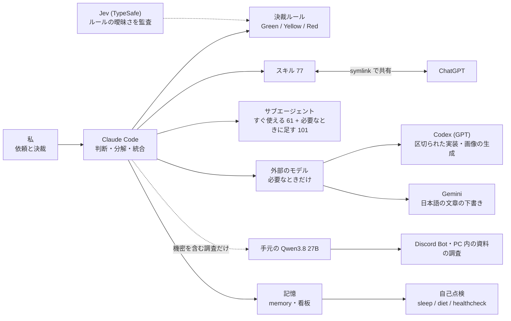

<div align="right">
  
</div>

# MaryCache

**個人開発のフルスタックエンジニアです。
Claude CodeにAIエージェントのチームを組み、そのチームと一緒に作っています。**


---

## About

IT企業に勤めながら、業務の外で個人開発を続けています。

作業のほとんどはClaude Codeの中で、本体とサブエージェントに任せています。
Claudeの外のモデルに出すのは3種類だけです。
区切られた実装と画像の生成はCodex（GPT）、日本語の文章の下書きはGemini、機密を含む調査は手元のPCで動かすQwenに任せます。

---

## How I Build



Claude Codeに何をどこまで任せるかは、決裁ルールに書いてあります。
操作を「やり直せるか」と「影響が自分の作業の中で済むか」の2つで、Green（任せる）・Yellow（私に確認する）・Red（しない）に分けています。
どれに当たるか分からない操作はYellowにします。

ルールの文に曖昧さが残っていると、Claudeと私で読み方が分かれます。
その曖昧さを探すために、TypeSafeのJev（System One）を使いました。
Jevは、文章を生成するかわりに、与えた状況への判断（選択肢の確率など）を返すモデルです。

同じルールと同じ操作の例をJevにも判定させ、Claudeの判定と食い違う箇所を探しました。
食い違いは4件から0件になり、ルールには9項目を足しました。

Claude Codeには、会話をまたいで残すメモのファイル（memory）と、作業の状態を書いたMarkdownのかんばん（看板）を持たせています。
セッションで分かったことは、終わるときに`sleep`でこの2つへ書き移します。
月に1回`diet`でmemory・看板・レビューの記録のうち古いものを減らし、`healthcheck`で、エラーを出さずに止まっている設定がないかを調べます。

全体の図は[Claude System Map](https://marycache.github.io/claude-system-map/)にあります。

---

## 公開しているもの

### [claude-code-companion-mod](https://github.com/MaryCache/claude-code-companion-mod)
**Claude Codeの会話の横に出すパネル（Claude Codeのmod）**

```
TypeScript (TSX) / Claude Code plugin (mod)
```

パネルには次の4つが出ます。

- Markdownで書いたかんばん
- Claudeが作ったファイルのうち、私に「見てほしい」と示したものの一覧
- 使用量のバー
- Claudeの返事に合わせて表情が変わる、ドット絵の相棒

公開する前に、コードレビュー用のサブエージェント2体（実装の観点と設計の観点）のレビューを3回通しました。

---

### [ja-cold-reader](https://github.com/MaryCache/ja-cold-reader)
**日本語の説明文を、人に見せる前に仕上げるClaude Codeのスキル2つ**

`cold-reader`は、書き上げた文章を、書いた経緯を知らないサブエージェントに読ませます。
書き手が前提を書き忘れたせいで読めない箇所を、6つの型に分けて指摘させ、書き手が直します。
6つの型は、指すものが決まらない、呼び名の言い直し、借りた言葉を中身を書かずに使う、誰も言っていないことの否定、最後の段落での言い直し、誰の話かが抜けて一般論に読める、です。
`line-layout`は、文ごとに改行し、役割の塊ごとに空行を入れます。

Claudeに、Discordでの技術的な質問1つへの返事を4本書かせて比べると、6つの型の失敗は、`cold-reader`を使わない2本で4件と7件、使った2本で1件と0件でした。
各2本なので、目安の数です。

このREADMEも、`cold-reader`に読ませて直しました。

---

### [ymm4-script-editor](https://github.com/MaryCache/ymm4-script-editor)（[デモ](https://marycache.github.io/ymm4-script-editor/)）
**YukkuriMovieMaker4向けの台本エディタ（ブラウザだけで動くPWA）**

```
Vite / React 19 / TypeScript (strict) / React Compiler / Vitest / Biome
```

キャラとセリフの組を並べた台本を編集し、CSV・`.ymscript`・Markdownで読み書きします。
AIに書かせた台本も、そのまま読み込めます。

サーバーを持たず、外部とも通信しません。
状態は1か所にまとめ、utilsは副作用のない純関数にしています。

---

### [advanced-design-md](https://github.com/MaryCache/advanced-design-md)
**サイトのURLからデザインの仕様書（DESIGN.md）を作る道具**

下のdesign-libraryのうち、URLからの抽出と、クイズ形式で仕様書を作る部分を公開しています（MITライセンス）。

---

## 非公開で作っているもの

### takubase（本番で稼働中）
**クトゥルフ神話TRPGの卓を、募集からセッション・記録までまとめて回すプラットフォーム**

```
Next.js 16 / React 19 / Supabase (Postgres・Realtime・Auth) / Cloudflare Workers / PWA / Tauri
```

Discordで遊ぶと、セッションのログが流れて後から追えなくなります。
takubaseは、ログを最初から検索できる記録として残す設計にしました。

機能は、グループ、キャラクターの管理、セッションルーム（チャンネル・チャット・ダイス・盤面・BGM）、個人とグループのカレンダー（ICSで配信）、Discord Botです。

- マイグレーションは106本で、37のテーブルにRLSをかけています
- 認可はpgTAPの726件のアサーションで、アプリ側はVitestで検査しています
- モバイル対応では、外枠だけをPC用とモバイル用に分け、中の画面は共有すると決め、ADRに残しました
- 画面を切り替えるときのワイプは自作しました。View Transitions APIは、Realtimeによる非同期の更新と噛み合わなかったためです
- Windows向けにTauriのデスクトップ版もあります

---

### design-library
**サイトのデザインを「観測した値」と「その値の意味」の2層で貯めるライブラリ**

参照したサイト19件のそれぞれについて、取り出した値だけをVANILLAに、その値に付けた名前と意味をINTERPRETEDに分けて持っています。
配色・パーツ・アニメーション・書体のレシピもあります。

新しいUIは、ヒアリングでDESIGN.mdを作り、このライブラリの具体的な値で補い、それから実装する、の順で作ります。

---

### video-library
**動画編集の部品をデータとして持つ倉庫**

```
Remotion / three.js / Canvas 2D
```

テロップの型が165件、文字の出入りの部品が860件あり、Remotionで作ったトランジションもあります。
どの部品も値をデータとして持ち、ブラウザで開けばその場で動きを確かめられます。
最近は、効果音とBGMの入れ方、光の入れ方、three.jsの立体文字の判断の基準も足しています。

---

### doc-standards
**開発ドキュメントの「どこまで書くか」をそろえる標準**

要件定義からテスト仕様までの13種類と、ADR・RFCなどアジャイルの6種類、合わせて19種類に対応しています。
どの開発手法にも共通する原則と、ウォーターフォール・アジャイルそれぞれの文書のレシピを分けて持ちます。
必須の見出しが欠けていないかなどは、Pythonのスクリプトで検査します。

---

### 手元のLLMの共有基盤
**RTX 5070 1枚で動かすQwen3.8 27Bを、PC内の資料の調査・Discord Bot・コーディングの補助で共有**

起動する前にVRAMの空き・ポート・ロックを調べ、足りなければ起動しません。

Discord Botは、会話の要約、過去の発言の検索、出典つきの調べものをします。
Botのログには、プロンプトと応答の本文を残しません。

---

### [hitohira-nikki](https://hitohira-nikki.cachela824.workers.dev/)（稼働中）
**AIと連携する日記アプリ**

```
Next.js / Supabase / Cloudflare Workers / GitHub Actions
```

AIとの会話から日記のJSONを作って取り込み、11軸の感情スコアを5つのカテゴリにまとめて見せます。

<details>
<summary>以前の作品</summary>

- [imadoko-remake](https://github.com/MaryCache/imadoko-remake) — バレーボールの座席を管理するアプリの作り直し（Next.js / Java 21 / Spring Boot / OpenAPI）。とにかく動かしていた作り方から、設計から入る作り方へ移った作品です
- [GUNDAM-TRPG](https://github.com/MaryCache/GUNDAM-TRPG) — 自作のTRPGのルールブック、キャラ作成アプリ、Discord Bot（Vue / VitePress / Discord.js）。ゲームのルールを設計として扱った経験が、今の作り方の土台です

</details>

---

## Skills

| カテゴリ | 技術 |
|---|---|
| フロントエンド | Next.js / React / TypeScript / PWA / three.js / Remotion |
| バックエンド・DB | Supabase / PostgreSQL（RLS・pgTAP） / Node.js / Python / Java・Spring Boot |
| インフラ | Cloudflare Workers / GitHub Actions / Tauri / Docker |
| AI | Claude Code（スキル・サブエージェント・hooks・mod） / Codex（実装・画像の生成） / 手元の LLM（llama.cpp） / Gemini（日本語の文章） |
| 設計・開発手法 | ADR / Documentation as Code / SSoT / TDD |

---

## Activities

<div align="left">
  
  
</div>

---

## Development Style

- 実装の前に、データ構造・状態遷移・依存関係を整理します
- 仕様・実装・ドキュメントの内容を、それぞれ1か所だけに書き、食い違いが出ない構造にします
- 認可・エラー処理・テストは、後から足さずに設計の段階で入れます
- AIの出力は確かめる材料として扱い、それだけで正しいとはみなしません。機械で検査できるものは機械で検査します

---

## Contact

GitHub: [@MaryCache](https://github.com/MaryCache)
