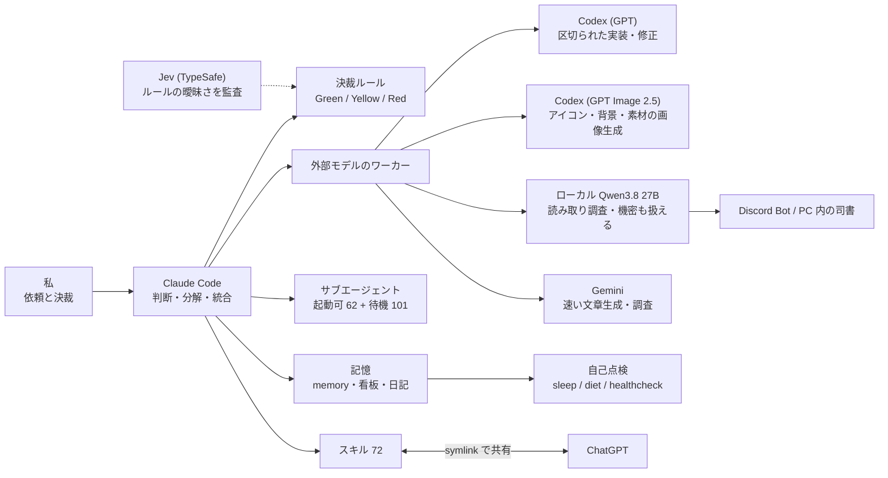

<div align="right">
  
</div>

# MaryCache

**個人開発のフルスタックエンジニア。AI エージェントのチームを設計して、一緒に作っています。**


---

## About

IT企業所属。業務外で個人開発を続けています。

「動けばいい」で終わらせず、作ったものは必ず技術資産に還元します。
「自分がシステムを理解していて、知識のない人にも分かりやすく説明・プレゼンできる状態」を「完成」と定義しています。

2026年の春からは、開発の中心が「AI に手伝ってもらう」から「AI のチームを設計して運用する」に移りました。
Claude Code をメインに置き、Codex・ローカル LLM・Gemini を役割ごとのワーカーとして使い分けています。
判断の境界（何を任せて、何を確認するか）もルールとして書き出しています。

---

## How I Build



- **決裁ルール**: 操作を「可逆か × 影響がローカルか共有か」で Green（任せる）/ Yellow（確認する）/ Red（しない）に分けています。迷ったら Yellow です。ルール自体の曖昧さは、TypeSafe の Jev（System One）に同じルールで判定させ、自分の解釈と突き合わせて見つけています（ズレ 4→0、ルールに9項目を追加）。
- **モデルの使い分け**: 重いモデルを「念のため」では使いません。探索・要約は軽いモデルかローカル、区切られた実装と画像の生成（GPT Image 2.5 で UI アイコン・背景・参考画像など）は Codex、急ぎの文章は Gemini、機密を含む調査はローカルだけ、と行き先を決めています。
- **記憶と自己点検**: セッションで得たことを memory と看板に蒸留する `sleep`、月1回の整理 `diet`、設定の沈黙した故障を探す `healthcheck` を自作して回しています。
- 全体像は [Claude System Map](https://marycache.github.io/claude-system-map/) にまとめています。

---

## Projects

### takubase（非公開・本番稼働中）
**クトゥルフ神話TRPG の卓を、募集からセッション・記録までまとめて回すプラットフォーム**

```
Next.js 16 / React 19 / Supabase (Postgres・Realtime・Auth) / Cloudflare Workers / PWA / Tauri
```

Discord にログが流れて追えなくなる問題を、最初から「検索できる資産」として設計し直すのが狙いです。
グループ、キャラクター管理、セッションルーム（チャンネル・チャット・ダイス・盤面・BGM）、個人とグループのカレンダー（ICS 配信）、Discord Bot があります。

- マイグレーション 106 本、RLS を 37 テーブルに、ポリシー 141 件
- pgTAP 726 アサーションで認可を検査し、Vitest でアプリ側を検査
- モバイル対応は「シェルだけを PC とモバイルに分け、中身は共有」と ADR に残して決めた
- 画面遷移のワイプは View Transitions API を使わず自作した（Realtime の非同期更新と噛み合わないため）
- Windows 向けに Tauri のデスクトップ版も用意

---

### [ymm4-script-editor](https://github.com/MaryCache/ymm4-script-editor)（[デモ](https://marycache.github.io/ymm4-script-editor/)）
**YukkuriMovieMaker4 向けの台本エディタ（ブラウザ完結の PWA）**

```
Vite / React 19 / TypeScript (strict) / React Compiler / Vitest / Biome
```

キャラ × セリフの台本を編集し、CSV・`.ymscript`・Markdown で入出力します。AI に作らせた台本をそのまま読み込めます。
バックエンドも外部通信もなく、状態は1か所に集め、utils は副作用のない純関数にしています。

---

### TRPG セッションログのまとめ（例: [無垢の神 サーガ](https://marycache.github.io/mukunokami-saga/)）
**生ログを、発言の帰属を区別したまとめページや動画台本に変換する仕組み**

Discord やココフォリアのログを決定的なパーサで中間データにし、PL / PC / GM / NPC、シナリオ内の発言とメタ雑談、ダイスを区別します。
4卓・5年ぶんを「全文 291千字 / 読み物 57千字 / 通し読み 12千字」の3段階で持ち、要約中の引用は原文と機械照合しています（引用 808 件で不一致 0）。

---

### design-library と [advanced-design-md](https://github.com/MaryCache/advanced-design-md)
**サイトのデザインを「観測した事実」と「意味付け」の2層で蓄積するライブラリ**

参照サイト 19 件を、取り出した値だけの VANILLA と、その値に名前と意味を付ける INTERPRETED に分けて持っています。配色・パーツ・アニメーション・書体のレシピもあります。
新しい UI は「ヒアリングで DESIGN.md を作る → ライブラリの具体値で補強する → 実装する」の流れで作ります。
公開しているのは道具の部分（URL からの抽出とクイズ形式の生成）で、MIT ライセンスです。

---

### video-library
**動画編集の部品をデータとして持つ倉庫**

```
Remotion / three.js / Canvas 2D
```

テロップの型 169 件、文字の出入りの部品 860 件、Remotion で作るトランジションがあります。
どれも「データが真実源で、ブラウザで開くだけで目で確かめられる」形にしています。

---

### doc-standards
**開発ドキュメントの「書くべき深さ」を揃える粒度標準**

要件定義からテスト仕様まで、ADR・RFC などアジャイル系も含む 19 種類に対応しています。
手法に依存しない原則層と手法別のレシピ層に分け、見出しの欠落などは Python の検査で機械的に判定しています。

---

### ローカル LLM の共有基盤
**RTX 5070 1枚の Qwen3.8 27B を、PC 内の司書・Discord Bot・コーディング補助で共有**

起動前に VRAM の空き・ポート・ロックを検査して、足りなければ起動を拒否します。
Discord Bot は会話の要約・過去の発言探し・出典つきの調べものをします。ログにプロンプトや応答の本文は残しません。

---

### [hitohira-nikki](https://hitohira-nikki.cachela824.workers.dev/)（稼働中）
**AI 連携の日記アプリ**

```
Next.js / Supabase / Cloudflare Workers / GitHub Actions
```

会話から日記の JSON を作って取り込み、11軸の感情スコアを5カテゴリにまとめて見せます。

<details>
<summary>以前の作品</summary>

- [imadoko-remake](https://github.com/MaryCache/imadoko-remake) — バレーボール座席管理アプリのリメイク（Next.js / Java 21 / Spring Boot / OpenAPI）。「とにかく動かす」から「設計から入る」へ移った作品
- [GUNDAM-TRPG](https://github.com/MaryCache/GUNDAM-TRPG) — 自作 TRPG システムのルールブック・キャラ作成アプリ・Discord Bot（Vue / VitePress / Discord.js）。ゲームルールを設計として扱った経験が土台

</details>

---

## Skills

| カテゴリ | 技術 |
|---|---|
| フロントエンド | Next.js / React / TypeScript / PWA / three.js / Remotion |
| バックエンド・DB | Supabase / PostgreSQL（RLS・pgTAP） / Node.js / Python / Java・Spring Boot |
| インフラ | Cloudflare Workers / GitHub Actions / Tauri / Docker |
| AI | Claude Code（スキル・サブエージェント・hooks 設計） / Codex（実装・GPT Image 2.5 の画像生成） / ローカル LLM（llama.cpp） / Gemini |
| 設計・開発手法 | ADR / Documentation as Code / SSoT / TDD |

---

## Activities

<div align="left">
  
  
</div>

---

## Development Style

- 実装前にデータ構造・状態遷移・依存関係を整理する
- 仕様・実装・ドキュメントの乖離を構造で防ぐ（真実源は1つ）
- 認可・エラー処理・テストは後付けにせず、設計の段階で入れる
- AI に任せる範囲と人が確認する範囲を、ルールとして書き出してから任せる
- AI の出力は証拠として扱い、正しさの証明にはしない。検査は機械でできるものから機械にする

---

## Contact

GitHub: [@MaryCache](https://github.com/MaryCache)
