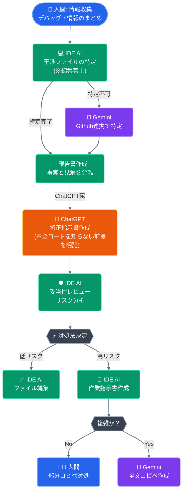

## マルチモーダルAIとIDEを統合したトラブルシューティング・フロー
ChatGPT（推論）、Gemini（解析）、IDE AI（司書）の特性を理解し、人間が「指揮官」としてリスクコントロールを行うことで、バグ修正の工数を最小化しつつ安全性を担保するワークフロー。

```mermaid
graph TD
    %% --- モダンなスタイル定義 (Tailwind風) ---
    classDef default color:#fff,stroke:#333,stroke-width:1px;
    classDef human fill:#2563eb,stroke:#60a5fa,stroke-width:2px,color:#fff,rx:5,ry:5;
    classDef ide fill:#059669,stroke:#34d399,stroke-width:2px,color:#fff,rx:5,ry:5;
    classDef gemini fill:#7c3aed,stroke:#a78bfa,stroke-width:2px,color:#fff,rx:5,ry:5;
    classDef gpt fill:#ea580c,stroke:#fbbf24,stroke-width:2px,color:#fff,rx:5,ry:5;
    classDef risk fill:#374151,stroke:#9ca3af,stroke-width:2px,color:#fff,rx:5,ry:5;

    %% --- 1. 情報収集 ---
    HumanStart(["👑 人間: 情報収集<br>デバッグ・情報のまとめ"]):::human

    %% --- 2. 特定 (No Edit) ---
    IDE_Find["💻 IDE AI
干渉ファイルの特定<br>(※編集禁止)"]:::ide
    Gemini_Find["🧠 Gemini<br>Github連携で特定<br>"]:::gemini

    %% --- 3. 報告書 ---
    Report["📝 報告書作成<br>事実と見解を分離"]:::ide

    %% --- 4. 推論 ---
    ChatGPT["💬 ChatGPT<br>修正指示書作成<br>(※全コードを知らない前提を明記)"]:::gpt

    %% --- 5. レビュー ---
    IDE_Review["🛡️ IDE AI<br>妥当性レビュー<br>リスク分析"]:::ide

    %% --- 6. 判断 ---
    Judge{{"⚡ 対処法決定"}}:::risk

    %% --- 7. 実行 ---
    AutoEdit["✅ IDE AI<br>ファイル編集"]:::ide
    CheckComplexity{{"複雑か？"}}:::risk
    IDE_Assist["📝 IDE AI<br>作業指示書作成"]:::ide
    ManualEdit["✍🏻 人間<br>部分コピペ対処"]:::human
    Gemini_Assist["🦾 Gemini<br>全文コピペ作成"]:::gemini

    %% --- 接続フロー ---
    HumanStart --> IDE_Find
    IDE_Find -->|特定不可| Gemini_Find
    IDE_Find -->|特定完了| Report
    Gemini_Find --> Report
    
    Report -->|ChatGPT宛| ChatGPT
    ChatGPT --> IDE_Review
    IDE_Review --> Judge
    
    Judge -->|低リスク| AutoEdit
    Judge -->|高リスク| IDE_Assist 

    IDE_Assist -->CheckComplexity  
    CheckComplexity -->|No| ManualEdit
    CheckComplexity -->|Yes| Gemini_Assist

    %% リンクのスタイル
    linkStyle default stroke:#64748b,stroke-width:2px;
```
